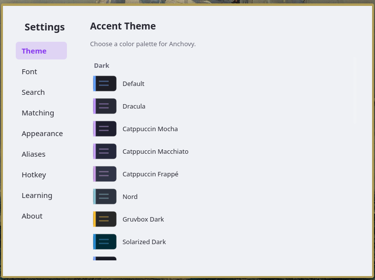

# Anchovy 🐟

A fast, keyboard-driven app launcher for Linux with a clean two-card UI.

<p align="center">
  
  
</p>
<p align="center">
  
</p>

## Features

- **App search** — fuzzy search your installed apps
- **File search** — `/` to search all files, `/v` videos, `/a` audio, `/i` images
- **Music mode** — `/a` searches your MPD library by title, artist, or album — album art shows on the right card
- **Calculator** — `/+` for instant math, result copies to clipboard
- **Aliases** — `yt`, `gg`, `gh` built in; add your own in settings
- **Alias input bar** — type an alias + space and a full-width input bar slides out
- **Smart web search** — falls back to your default browser's search engine automatically
- **26 themes** — including Catppuccin, Dracula, Nord, Tokyo Night, Rose Pine, Gruvbox, and more
- **Learning system** — remembers what you launch most and boosts those results
- **Settings window** — live theme preview, alias editor, font picker, and more
- **Hot reload** — settings changes apply instantly without restarting

## Search Modes

| Type | Mode |
|------|------|
| `firefox` | App search |
| `/lofi` | All files |
| `/v sabrina` | Videos only |
| `/a espresso` | Audio (MPD library) |
| `/i wallpaper` | Images only |
| `/+ sqrt(144)` | Calculator |
| `yt something` | YouTube search |
| `gg something` | Google search |
| `gh something` | GitHub search |

## Requirements

- Python 3.8+
- PyQt6
- `xdg-utils` (for opening files and URLs)
- `mpv` (optional, for playing audio/video)
- `mpc` (optional, for MPD music search)

## Installation

```bash
git clone https://github.com/taubut/Anchovy.git
cd Anchovy
bash install.sh
```

Then bind `~/.local/bin/anchovy-toggle` to a hotkey (e.g. `Meta+Space`) in your desktop environment.

### KDE
System Settings → Shortcuts → Custom Shortcuts → Add Command → set to `~/.local/bin/anchovy-toggle`

### i3 / Sway
```
bindsym $mod+space exec ~/.local/bin/anchovy-toggle
```

## Usage

| Key | Action |
|-----|--------|
| Type | Search |
| `↓` | Expand results |
| `↑ ↓` | Navigate results |
| `Tab / →` | Cycle actions (Open, Reveal, Copy Path…) |
| `Enter` | Execute |
| `Ctrl+,` | Open settings |
| `Escape` | Dismiss |

## Configuration

Config lives at `~/.local/share/anchovy/config.json`. Open the settings window with `Ctrl+,` from the launcher.

## License

MIT
